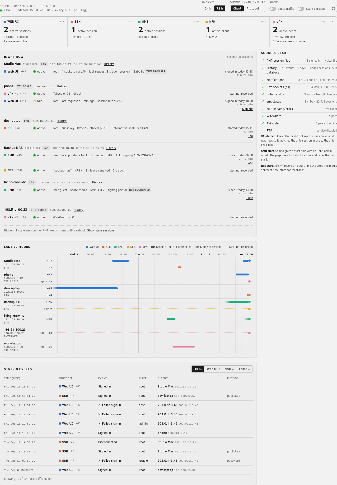
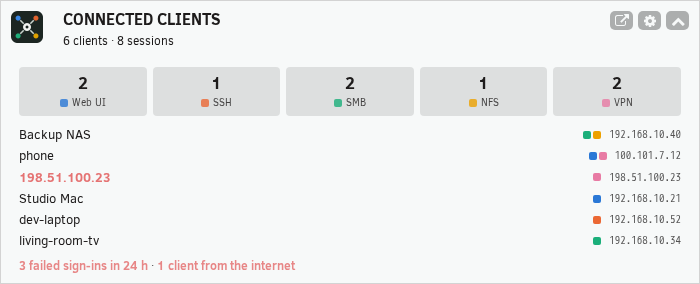
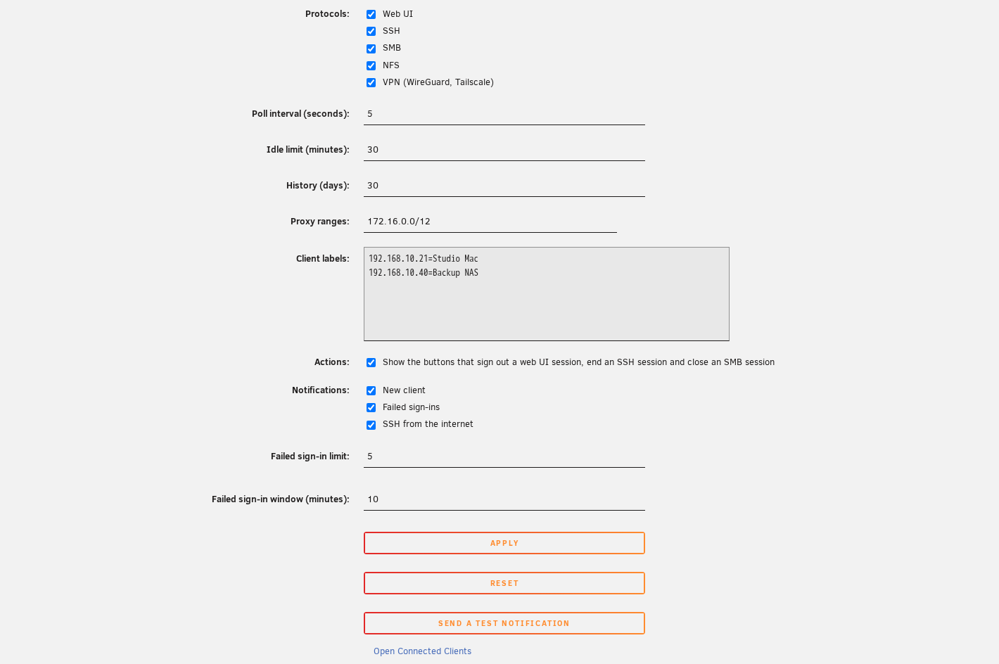

# Connected Clients

Connected Clients shows who is connected to your Unraid server now, and who was connected in the last 30 days.

Open it at **Tools → Connected Clients**.

## Screenshots

The images use synthetic data (`ui-build/tests/e2e/screenshots/demo-state.ts`): no real client address or name.







## What it shows

- **Web UI** — each signed-in webGUI session: the client address, the connection path (LAN, Tailscale, WireGuard), the sign-in time and the last request.
- **SSH** — each SSH session: user, client address, key type, and the number of commands.
- **SMB** — each SMB session: user, client address, shares, protocol version, signing and encryption.
- **NFS** — each NFS v4 client: address, client name and lease state.
- **VPN** — active WireGuard and Tailscale peers.
- A 24-hour or 72-hour timeline, and a list of sign-in events (successful and failed).
- **History** for each client: its ended sessions and sign-in events, kept for 30 days and after a reboot.
- A **Dashboard tile**: the sessions in use now for each protocol, the clients with the most sessions, and the failed sign-ins of the last 24 hours.
- **Actions**: sign out a web UI session, end an SSH session, or close an SMB session, after a confirmation. Your own session is never a target.

Use the toggles on the page to show or hide local traffic (this server and its Docker containers) and stale web sessions. Your browser remembers your choice.

## Settings

Open **Settings → User Utilities → Connected Clients**, or the cog on the Connected Clients page:

- **Protocols**: turn each protocol (web UI, SSH, SMB, NFS, VPN) on or off.
- **Poll interval** and **idle limit**: how often the plugin reads, and when an idle web session becomes stale.
- **Proxy ranges**: addresses marked "Via proxy" (the default covers Docker networks).
- **Client labels**: give an IP or MAC address a name, for example `192.168.1.20=Living room TV`.

- **History retention**: how many days of history to keep (default 30).
- **Notifications**: alerts for a new client, many failed sign-ins from one address (default 5 in 10 minutes), and an SSH sign-in from the internet. They go out as Unraid notifications, so your notification agents apply. A button sends a test notification.
- **Actions**: show or hide the action buttons (default shown).

If a source fails, a banner on the page names it. A service that is simply off (for example NFS) shows in its own cell.

## How it works

A small collector reads these sources every 5 seconds: PHP session files, syslog, `ss`, `smbstatus`, `/proc/fs/nfsd`, `wg` and `tailscale`. It only reads. It does not change nginx, PHP, Samba or any other Unraid setting. Only an action that you confirm changes something, and it ends one session.

The page and the tile update live through nchan, the push channel of the webGUI. If nchan is silent, they read the data from the server instead.

The live data stays in RAM (`/tmp/unraid-connections`). Session IDs never appear; the page shows a short hash tag instead.

History is a SQLite database in RAM. The plugin copies it to the flash drive (`/boot/config/plugins/unraid-connections/history.db`) every 30 minutes when it changed, when the collector stops, and when the array stops. After a reboot, the plugin restores it. An rsyslog rule (`/etc/rsyslog.d/40-unraid-connections.conf`) copies the webGUI and SSH sign-in lines to `/var/log/unraid-connections/events.log`, so sign-in events are kept when syslog rotates. Uninstall removes the rule and keeps the flash copy.

To control the collector:

```bash
/usr/local/emhttp/plugins/unraid-connections/scripts/rc.unraid-connections status
/usr/local/emhttp/plugins/unraid-connections/scripts/rc.unraid-connections restart
```

## Limits

- Unraid does not record the client address in a webGUI session. The plugin takes it from the syslog sign-in line while the session is new. For a session that started before the plugin, the address is inferred or unknown.
- A sign-in through a reverse proxy or a container shows the proxy address.
- NFS v3 clients appear only as live TCP connections.

## Support

- Questions and help: the Unraid forum support thread, https://forums.unraid.net/topic/200548-plugin-support-unraid-plugin-to-view-in-near-real-time-what-and-who-is-connected-to-your-core-host-services/
- Bug reports: https://github.com/johnpwhite/unraid-plg-connections/issues
- Diagnostics: run `bash /usr/local/emhttp/plugins/unraid-connections/scripts/diagnostics.sh` on the server and add the output to your post. It only reads, and it prints no session ID or password.
